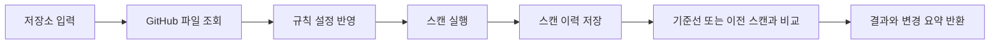
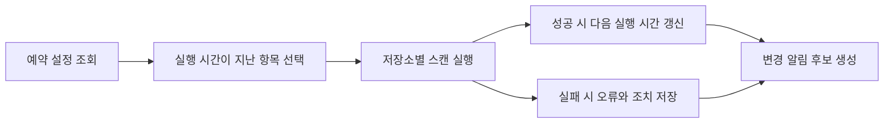

# 예약 스캔과 변경 알림 설계

## 목표

Repository scan 서비스에 저장소별 예약 스캔을 추가한다. 사용자는 저장소마다 주기를 설정할 수 있고, 예약 실행 결과에서 새 취약점과 해결된 취약점을 바로 확인할 수 있어야 한다.

이 기능은 Repository scan 서비스에만 적용한다. Security and Network Jobs 서비스와 데이터, 화면, API를 섞지 않는다.

## 범위

이번 단계에 포함한다.

- 저장소별 예약 스캔 설정 저장
- 예약 실행 시점이 지난 저장소 조회
- 예약 대상 저장소 스캔 실행
- 기존 기준선 또는 이전 스캔과 비교
- 새 취약점, 해결된 취약점, 유지 중 취약점, 오탐 제외 항목 요약
- 화면에서 예약 설정과 최근 예약 실행 결과 표시

이번 단계에 포함하지 않는다.

- 슬랙, 전자우편, 푸시 알림 발송
- 별도 백그라운드 작업 서버
- 외부 작업 대기열
- Security and Network Jobs 서비스와의 통합

## 접근 방식

첫 구현은 제품 내부의 예약 설정과 실행 API를 만든다. 실제 자동 호출은 후속 단계에서 맥 자동 실행, Render Cron, GitHub Actions, 또는 별도 작업 서버로 붙일 수 있게 한다.

이 방식은 현재 구현된 스캔 이력, 기준선 비교, 오탐 처리, 규칙 설정을 그대로 재사용한다. 새 스캔 엔진을 만들지 않고 기존 스캔 실행 흐름을 공용 함수로 분리해 수동 스캔과 예약 스캔이 같은 동작을 사용하게 한다.

## 데이터 모델

예약 설정은 저장소 단위로 저장한다.

- `repositoryKey`: `owner/name`
- `repositoryUrl`: 스캔할 GitHub 저장소 주소
- `installationId`: GitHub App 설치 식별자, 공개 저장소 URL 스캔이면 비어 있을 수 있음
- `enabled`: 예약 사용 여부
- `intervalDays`: 실행 주기
- `nextRunAt`: 다음 실행 예정 시각
- `lastRunAt`: 마지막 실행 시각
- `lastScanId`: 마지막 예약 실행으로 저장된 스캔 식별자
- `notifyOnNewFindings`: 새 취약점 알림 여부
- `notifyOnResolvedFindings`: 해결된 취약점 알림 여부
- `createdAt`, `updatedAt`: 생성과 수정 시각

기존 JSON 저장소와 SQLite 저장소를 모두 지원한다. JSON은 기존 `scan-settings.json`에 `schedules` 배열을 추가한다. SQLite는 `scan_schedules` 테이블을 추가한다.

## API

예약 설정 API를 추가한다.

- `GET /api/scans/schedules`: 모든 예약 설정을 반환한다.
- `POST /api/scans/schedules`: 예약 설정을 생성하거나 갱신한다.
- `DELETE /api/scans/schedules`: 저장소 예약 설정을 삭제한다.
- `POST /api/scans/schedules/run-due`: 실행 시간이 지난 예약 스캔을 실행한다.

`run-due` 응답은 저장소별 실행 결과를 담는다.

- 성공: 스캔 식별자, 저장 시각, 비교 요약, 알림 후보
- 실패: 저장소 키, 오류 메시지, 사용자가 할 수 있는 조치
- 실행 대상 없음: 빈 결과와 현재 시각

## 스캔 실행 흐름

수동 스캔과 예약 스캔은 같은 내부 함수를 사용한다.

예약 스캔은 다음 흐름을 사용한다.

## 변경 알림

이번 단계의 알림은 외부 발송이 아니라 화면과 API 응답에서 확인하는 알림 후보이다.

알림 후보는 다음 경우에 생성한다.

- 새 취약점이 있고 `notifyOnNewFindings`가 켜져 있음
- 해결된 취약점이 있고 `notifyOnResolvedFindings`가 켜져 있음

알림 후보는 다음 내용을 포함한다.

- 저장소
- 스캔 식별자
- 새 취약점 수
- 해결된 취약점 수
- 가장 높은 위험도
- 사용자 조치 문구

## 화면

Repository scan 화면에 예약 스캔 영역을 추가한다.

- 현재 선택한 저장소의 예약 사용 여부
- 실행 주기 선택
- 다음 실행 예정 시각
- 마지막 예약 실행 시각과 마지막 스캔 링크
- 예약 저장, 예약 해제, 지금 실행 버튼
- 최근 예약 실행 결과 요약

화면 문구는 한글과 영어를 함께 표기한다. 예: `예약 스캔 / Scheduled scan`

## 오류 처리

GitHub App 미설정, 저장소 접근 실패, 권한 거부, 요청 제한은 기존 스캔 API의 오류 조치 문구를 재사용한다. 예약 스캔 중 일부 저장소가 실패해도 다른 저장소 실행은 계속한다.

실패한 예약은 삭제하지 않는다. 실패 결과를 응답에 포함하고 다음 실행 시간은 주기대로 갱신하지 않는다. 사용자가 설정을 수정하거나 수동 실행으로 복구할 수 있게 한다.

## 검증

다음 테스트를 추가한다.

- 예약 설정 JSON 저장소 테스트
- 예약 설정 SQLite 저장소 테스트
- 실행 대상 계산 테스트
- 예약 실행 API 테스트
- 수동 스캔과 예약 스캔이 같은 비교 결과 구조를 반환하는 테스트
- 화면에서 예약 설정과 최근 실행 결과가 표시되는 테스트

## 완료 기준

- 저장소별 예약 설정을 저장, 조회, 삭제할 수 있다.
- 실행 시간이 지난 예약 스캔만 실행된다.
- 예약 실행 결과가 기존 스캔 이력에 저장된다.
- 새 취약점과 해결된 취약점 요약이 응답과 화면에 표시된다.
- 기존 수동 스캔 기능은 동일하게 동작한다.
